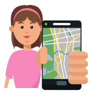

  

  

    
    
    
    

# **The Programming Club**

The club’s aim is to create a fun, supportive learning environment which fosters creativity and enhances your programming skills and knowledge. To create a platform where regardless of your branch or background, you can learn to code, think and bridge the gap between theoretical knowledge and practical real-world solutions. We are committed to giving our best efforts to bring exposure to our students and promote the spirit of collaboration, competition and curiosity. 🤩

---

  

  

## Learning from the Experts? We have it sorted
We hold engaging and informative `#AskMeAnything` Sessions with our industry leaders, experts and our alumni. We have invited people from technology giants such as Google and Facebook. They share their experience, journey and deliver remarkable insights! 👩‍💻👨‍💻
  

---

  

  

## Want to create your own JARVIS? We got you covered! 
🤖 We organize hands-on `#workshops` on various technical domains from Machine Learning to App Development to Web Development and muchhhh more!  We organize events for all types of audience with varying levels of experience! 😎
 

---

  

  

## Do you like challenges? Worry not!

Our `#Competitions` like "The Website Making Challenge" make you solve real-life problems and learn how to build a website from scratch with no prior programming experience.(Isn’t that cool?🤑). The club has been helping its members to prepare for International Programming Competitions such as ACM ICPC and IEEEXtreme and perform well in them. We also frequently organize contests to keep up the competitive spirit! 👯
